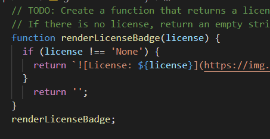

# README_Generator

## Description
-------------------------------------------------------------------------------------------------------------------------------------------------
This is a README generator using node.js that allows users to quickly create a markdown file for their projects. When 'node index.js' is initiated, you are presented with a serious of prompts to build a readme markdown file. Answer each question, then watch as the readme is auto-generated.

\
\

## Installation
--------------------------------------------------------------------------------------------------------------------------------------------------
In order to use this generator, you must: 
1. Use Git Bash or the VS terminal to run the following: 
* Run 'npm i' to pull down the npm node package manager
* Run 'npm init -y' to install package.json\

* Run 'npm install inquirer' to install the inquirer package that provides the needed prompt coding.
2. Open the index.js file in Git Bash or the VS terminal
3. Run 'node index.js' to begin the README generator program.

## Usage
--------------------------------------------------------------------------------------------------------------------------------------------------
This program can be used with permission to auto-generate a Readme markdown file. Watch the video to see how the program works.\
\
<video width="320" height="240" controls>
  <source src="./Images/Readme_Gen_Video.mp4" type="video/mp4">
</video>

## License
--------------------------------------------------------------------------------------------------------------------------------------------------

## Contact
--------------------------------------------------------------------------------------------------------------------------------------------------
If you have any questions, please contact me at:\
✉️[Email](mailto:hrkoren@gmail.com)\
📂[GitHub](<https://github.com/hrkoren>)